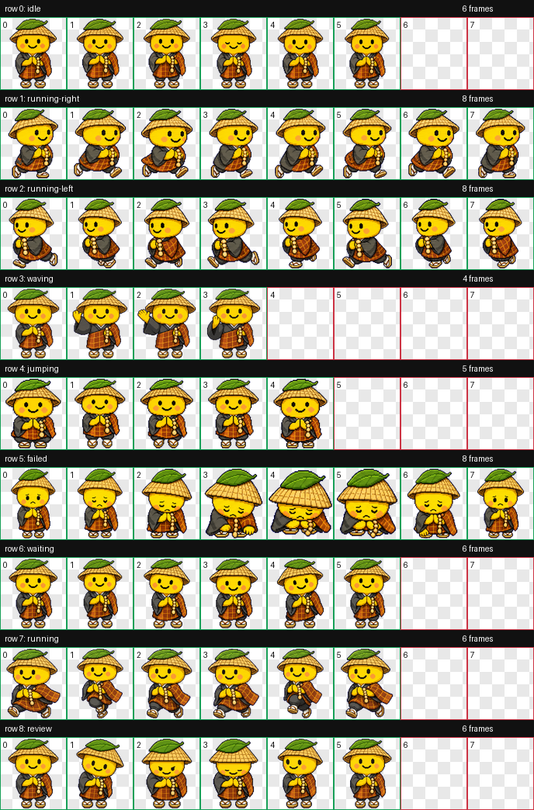

# ゆず坊 Codex Pet

ゆず坊は、笠と法衣をまとった小さなゆずのお坊さんの Codex カスタムペットです。



## Install

Clone this repository directly into Codex's custom pet directory:

```bash
mkdir -p ~/.codex/pets
git clone https://github.com/Keseras34938976/yuzubou-codex-pet.git ~/.codex/pets/yuzubou
```

Then restart Codex. If Codex shows a pet picker, select `ゆず坊`.

## Manual Install

Download this repository as a ZIP, then place the extracted folder here:

```text
~/.codex/pets/yuzubou/
```

The folder should contain:

```text
pet.json
spritesheet.webp
```

## Files

- `pet.json` - Codex custom pet manifest.
- `spritesheet.webp` - 8x9 Codex pet animation atlas.
- `preview.png` - Contact sheet preview for GitHub.
- `validation.json` - Latest local validation result.

## Compatibility

This pet follows the Codex custom pet contract:

- Atlas size: `1536x1872`
- Grid: 8 columns x 9 rows
- Cell size: `192x208`
- Background: transparent
- Sprite format: WebP with alpha channel

## License

Released under the MIT License. The pet artwork was created for community use with the Codex `hatch-pet` workflow from a user-provided reference image.
